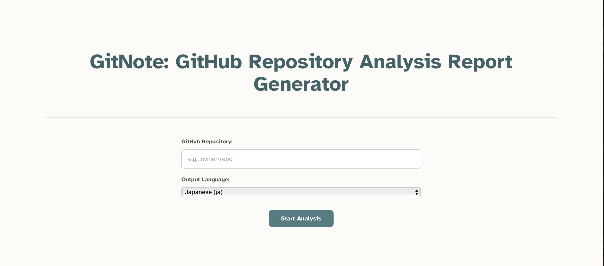

# GitNote: GitHub Repository Analysis Report Generator


GitNote is a web application that analyzes a given GitHub repository and generates a comprehensive report covering its usage, installation, structure, and code logic using AI. It fetches repository information from uithub.com and utilizes the Cerebras API for analysis.

## Features

*   Analyzes public GitHub repositories.
*   Generates reports in multiple languages (currently supports English and Japanese, with potential for others).
*   Provides insights into:
    *   **Usage:** How to use the repository.
    *   **Installation:** Setup and environment configuration.
    *   **Repository Structure:** Directory layout and key files.
    *   **Code Logic:** Core algorithms and implementation details.
*   Uses `react-markdown` and `react-syntax-highlighter` for clear report presentation.
*   AI-powered chat interface for repository analysis:
    *   Ask questions about the repository content and receive detailed explanations
    *   Get clarification on code implementation and architecture
    *   Explore repository features and usage through interactive dialogue
*   Enhanced chat interface features:
    *   Natural text input with Enter key for line breaks
    *   Send messages with Ctrl+Enter (Cmd+Enter on Mac)
    *   Real-time streaming responses from AI

## Prerequisites

*   [Node.js](https://nodejs.org/) (LTS version recommended)
*   [npm](https://www.npmjs.com/) or [yarn](https://yarnpkg.com/)

## Installation

1.  **Clone the repository:**
    ```bash
    git clone <repository-url>
    cd git-note
    ```

2.  **Install dependencies:**
    ```bash
    npm install
    # or
    yarn install
    ```

3.  **Set up environment variables:**
    *   Create a `.env` file in the project root by copying `.env.example`:
        ```bash
        cp .env.example .env
        ```
    *   Open the `.env` file and add your Cerebras API key:
        ```env
        VITE_CEREBRAS_API_KEY="<your_cerebras_api_key>"
        ```
        You need to obtain an API key from [Cerebras](https://www.cerebras.net/).

## Usage

1.  **Start the development server:**
    ```bash
    npm run dev
    # or
    yarn dev
    ```
2.  Open your browser and navigate to the local URL provided (usually `http://localhost:5173`).
3.  Enter the GitHub repository name (e.g., `facebook/react`) or paste a GitHub URL (e.g., `https://github.com/facebook/react` or `https://github.com/facebook/react/tree/main`) and select the desired language for the report.
4.  Click "Analyze Repository".
5.  Wait for the analysis to complete. The generated report will be displayed on the page.

## Environment Variables

The following environment variables can be configured in your `.env` file:

*   `VITE_CEREBRAS_API_KEY`: Your API key for accessing the Cerebras API
*   `VITE_OPENAI_API_KEY`: Your API key for accessing the OpenAI API
*   `VITE_ANTHROPIC_API_KEY`: Your API key for accessing the Anthropic API
*   `VITE_COSTOM_MODE`: Set to "true" to enable custom API mode
*   `VITE_COSTOM_BASE_URL`: Base URL for your custom OpenAI-compatible API endpoint
*   `VITE_COSTOM_API_KEY`: API key for your custom API
*   `VITE_COSTOM_MODEL_NAME`: Model name to use with your custom API

You only need to set the API key for the model you plan to use. The default model can be configured in `src/config/models.yaml`. When custom mode is enabled, the configuration from `models.yaml` will be ignored, and the custom API settings will be used instead.

## Model Configuration

The application supports multiple language models that can be configured in `src/config/models.yaml`, or you can use a custom OpenAI-compatible API:

### Standard Configuration

```yaml
models:
  # Default model to use
  default: cerebras-llama4

  # Available models
  available:
    cerebras-llama4:
      name: llama-4-scout-17b-16e-instruct
      baseUrl: https://api.cerebras.ai/v1/chat/completions
      apiKeyEnvName: VITE_CEREBRAS_API_KEY
      defaultParams:
        temperature: 0.7
        max_tokens: 1000
    # Add other models as needed
```

You can:
- Change the default model by modifying the `default` value
- Add new models to the `available` section
- Configure model-specific parameters like temperature and max_tokens

### Custom API Mode

You can use any OpenAI-compatible API by enabling custom mode in your `.env` file:

```env
VITE_COSTOM_MODE="true"
VITE_COSTOM_BASE_URL="https://your-custom-api.com/v1/chat/completions"
VITE_COSTOM_API_KEY="your-api-key"
VITE_COSTOM_MODEL_NAME="your-model-name"
```

When custom mode is enabled:
- The configuration from `models.yaml` will be ignored
- All requests will be sent to your custom API endpoint
- The API is expected to be OpenAI-compatible
- Default parameters (temperature: 0.7, max_tokens: 4096) will be used

## Contributing

Contributions are welcome! Please feel free to submit issues or pull requests.

## License

This project is licensed under the MIT License - see the [LICENSE](LICENSE) file for details.

---

[日本語版 README (Japanese README)](README_ja.md)
