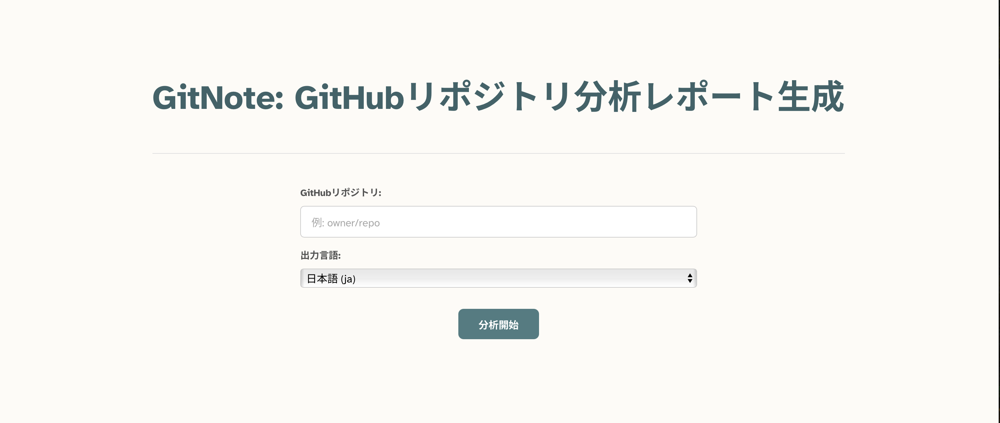

# GitNote: GitHubリポジトリ分析レポート生成ツール



GitNoteは、指定されたGitHubリポジトリを分析し、AIを使用してその使い方、インストール方法、構造、コードロジックを網羅した包括的なレポートを生成するWebアプリケーションです。uithub.comからリポジトリ情報を取得し、Cerebras APIを利用して分析を行います。

## 機能

*   公開されているGitHubリポジトリを分析します。
*   複数の言語でレポートを生成します（現在は英語と日本語に対応しており、他の言語への拡張も可能です）。
*   以下の点に関する洞察を提供します:
    *   **使い方 (Usage):** リポジトリの使用方法。
    *   **インストール方法 (Installation):** セットアップと環境設定。
    *   **リポジトリ構造 (Repository Structure):** ディレクトリ構成と主要なファイル。
    *   **コードロジック (Code Logic):** 中核となるアルゴリズムと実装の詳細。
*   `react-markdown` と `react-syntax-highlighter` を使用して、レポートを分かりやすく表示します。
*   リポジトリ分析のためのAIチャット機能:
    *   リポジトリの内容について質問し、詳細な説明を受けることが可能
    *   コードの実装やアーキテクチャについての説明を取得
    *   インタラクティブな対話を通じてリポジトリの機能や使用方法を探索
*   チャットインターフェースの機能強化:
    *   Enterキーで自然な改行入力
    *   Ctrl+Enter（Macの場合はCmd+Enter）でメッセージ送信
    *   AIからのリアルタイムストリーミングレスポンス

## 前提条件

*   [Node.js](https://nodejs.org/) (LTS版推奨)
*   [npm](https://www.npmjs.com/) または [yarn](https://yarnpkg.com/)

## インストール手順

1.  **リポジトリをクローン:**
    ```bash
    git clone <repository-url>
    cd git-note
    ```

2.  **依存関係をインストール:**
    ```bash
    npm install
    # または
    yarn install
    ```

3.  **環境変数を設定:**
    *   プロジェクトルートに `.env.example` をコピーして `.env` ファイルを作成します:
        ```bash
        cp .env.example .env
        ```
    *   `.env` ファイルを開き、Cerebras APIキーを追加します:
        ```env
        VITE_CEREBRAS_API_KEY="<your_cerebras_api_key>"
        ```
        APIキーは [Cerebras](https://www.cerebras.net/) から取得する必要があります。

## 使い方

1.  **開発サーバーを起動:**
    ```bash
    npm run dev
    # または
    yarn dev
    ```
2.  ブラウザを開き、提供されたローカルURL（通常は `http://localhost:5173`）にアクセスします。
3.  GitHubリポジトリ名（例: `facebook/react`）またはGitHub URL（例: `https://github.com/facebook/react` や `https://github.com/facebook/react/tree/main`）を入力し、レポートの言語を選択します。
4.  「Analyze Repository」ボタンをクリックします。
5.  分析が完了するのを待ちます。生成されたレポートがページに表示されます。

## 環境変数

以下の環境変数を `.env` ファイルで設定できます：

*   `VITE_CEREBRAS_API_KEY`: Cerebras APIにアクセスするためのAPIキー
*   `VITE_OPENAI_API_KEY`: OpenAI APIにアクセスするためのAPIキー
*   `VITE_ANTHROPIC_API_KEY`: Anthropic APIにアクセスするためのAPIキー

使用予定のモデルのAPIキーのみを設定すれば良く、デフォルトで使用するモデルは `src/config/models.yaml` で設定できます。

## モデル設定

このアプリケーションは複数の言語モデルをサポートしており、`src/config/models.yaml` で設定できます：

```yaml
models:
  # デフォルトで使用するモデル
  default: cerebras-llama4

  # 利用可能なモデル
  available:
    cerebras-llama4:
      name: llama-4-scout-17b-16e-instruct
      baseUrl: https://api.cerebras.ai/v1/chat/completions
      apiKeyEnvName: VITE_CEREBRAS_API_KEY
      defaultParams:
        temperature: 0.7
        max_tokens: 1000
    # 他のモデルを必要に応じて追加
```

以下のようなカスタマイズが可能です：
- `default` の値を変更してデフォルトモデルを切り替え
- `available` セクションに新しいモデルを追加
- temperatureやmax_tokensなどのモデル固有のパラメータを設定

## コントリビューション

コントリビューションを歓迎します！IssueやPull Requestを自由にご提出ください。

## ライセンス

このプロジェクトはMITライセンスの下でライセンスされています。詳細は [LICENSE](LICENSE) ファイルをご覧ください。

---

[English README (英語版 README)](README.md)
